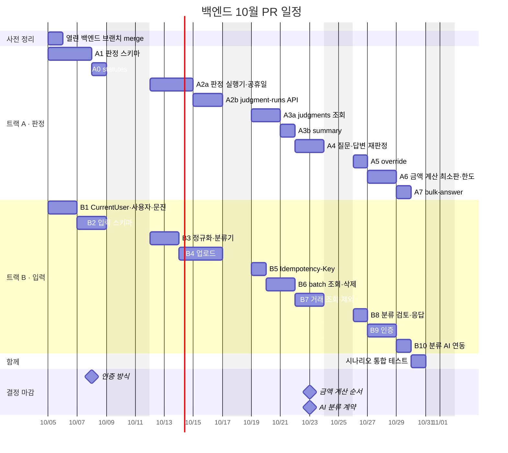
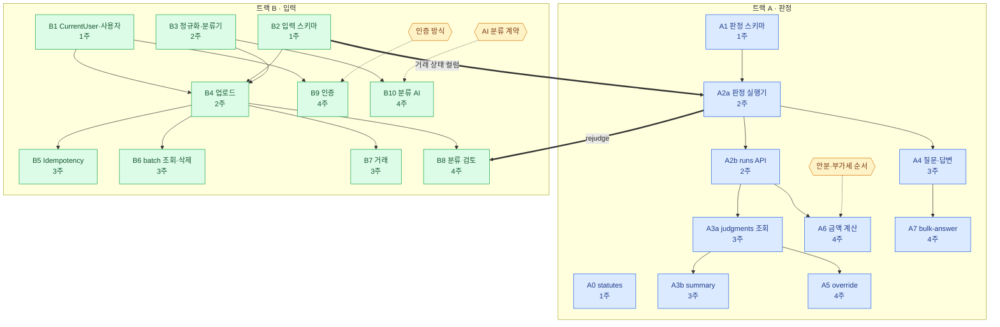
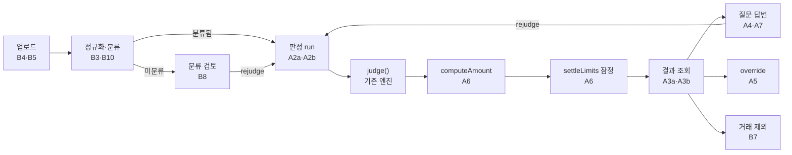

# 백엔드 API 및 서비스 계층 구현 계획 (2026년 10월)

> 목표: 10/31까지 업로드부터 질문 응답과 수정까지 실제 서비스로 동작하게 한다.
> 기준은 프론트엔드에서 `frontend/src/api/index.ts`를 mock에서 HTTP 호출로 전환할 수 있는 상태다.
> v1.0 배포 일정은 11/6이다.

## 한눈에 보기

| 항목 | 내용 |
| --- | --- |
| 인원 | 백엔드 담당자 2명이다. 트랙 A(판정)와 트랙 B(입력)로 역할을 나눈다. |
| PR 크기 | 추가 1000줄 이하다. 테스트 코드, 마이그레이션 SQL, worklog를 모두 포함한 GitHub `+` 수치 기준이다. |
| PR 수 | 트랙 A 11개, 트랙 B 10개다. 1인당 주 2~3개 merge를 목표로 한다. |
| 10월 범위 | 기본 흐름과 임시 사용자를 구현하고 4주차에 인증을 도입한다. 공휴일 정적 YAML, 금액 계산 최소판, 분류 AI 연동, bulk-answer를 포함한다. |
| 미룰 순서 | B10 분류 AI → A7 bulk-answer → A6 금액 계산 순서로 미룬다. 단, 인증 작업은 미루지 않는다. |

### 일정

### PR 의존 관계

화살표는 선행 PR이 merge되어야 후속 PR을 시작할 수 있음을 나타낸다.
굵은 화살표는 트랙 간 접점을 뜻하며, 육각형은 직접 내려야 할 의사결정을 의미한다.

### 완성 후 요청 흐름

각 PR이 실제 요청 흐름 중 어느 단계를 담당하는지 보여준다.

## 공통 규칙

- 목 교체 절차: `backend/README.md`의 "목 응답" 절차를 따른다.
  1. 컨트롤러에 주입된 `*MockData`를 서비스 코드로 교체한다.
  2. 해당 메서드의 `@MockResponse`를 삭제한다.
  3. 사용하지 않게 된 mock 메서드를 삭제한다.
  - `ApiResponseContractTest`와 `ApiContractIntegrationTest`는 항상 통과(green)해야 한다.
- 패키지 구조: 기존 관례인 `<feature>.api`, `domain`, `persistence` 구성을 따른다. 서비스는 기능별 패키지 안에 배치한다. 공용 계층은 두 개 이상의 기능에서 실제로 공유할 때만 새로 만든다.
- 마이그레이션 번호: 두 트랙의 PR 간에 번호가 충돌할 수 있다. 따라서 merge 직전에 develop 브랜치의 최신 번호 +1로 변경(rename)한다. 이미 적용된 마이그레이션은 수정하지 않는다(`db/README.md`).
- PR 크기 확인: PR을 올리기 전에 `git diff --shortstat origin/develop...HEAD`를 확인한다. 추가 줄 수가 1000줄을 초과하면 "스키마 및 엔티티"와 "서비스 및 API"로 작업을 나눈다.
- PR별 검증 항목:
  - `.\backend\gradlew.bat -p backend test` 실행
  - `integrationTest` 실행 (Docker 필요)
  - eval 리포트에 기능 회귀가 없는지 확인
  - `/worklog` 작성
- 사용자 식별: B1에서 `CurrentUser` 리졸버를 작성하고 모든 서비스는 이를 통해 userId를 전달받는다. 초기에는 고정 임시 사용자를 반환하도록 구현하고, B9에서 구현체만 Bearer 토큰 검증 방식으로 교체한다.

## 사전 정리 (1주차 월요일)

마이그레이션과 응답 형식이 충돌하지 않도록 현재 열려 있는 아래 브랜치를 먼저 merge한 뒤 작업을 시작한다.

- `chore/release-from-develop`
- `chore/db-deploy-safety`: 마이그레이션 호환 규칙
- `feature/classification-group-transactions`: 분류 그룹 응답 변경

## 트랙 분담

- 트랙 A(판정): run, 결과 조회, 질문, override, 금액 계산, bulk-answer를 담당한다. 엔진과 영속 서비스를 감싸는 영역이다.
- 트랙 B(입력): 사용자 및 문진, 업로드, 정규화와 분류, 거래, 분류 검토, 인증을 담당한다. 판정에 입력할 데이터를 가공하는 영역이다.
- 두 트랙 사이의 접점은 다음 두 곳이다.
  1. B2의 거래 상태 컬럼(`user_inclusion`, `classification_status`)을 트랙 A에서 run 대상 선정과 현재 결과 필터링에 사용한다. 따라서 B2가 A2a보다 먼저 merge되어야 한다.
  2. A2a가 `rejudge(transactionIds, origin)` 진입점을 제공한다. B8의 분류 응답 처리에서 이를 호출한다(origin 값은 `classification_review_id`).
- 작업 순서는 프론트엔드 화면 순서(업로드 → 분류 → run → 결과 → 질문)에 맞춘다. 이를 통해 프론트엔드가 앞 화면부터 차례로 HTTP 호출로 전환할 수 있도록 한다.

## 주차별 PR

### 1주차 (10/5~10/10, 10/9 한글날): 기반

| PR | 트랙 | 내용 |
| --- | --- | --- |
| A1 | A | 판정 관련 스키마를 구성한다. `judgment`에서 `state` 컬럼을 제거하고 origin FK 4개와 `CHECK num_nonnulls(...)=1`을 추가한다. `judgment_run`, `judgment_run_item`, `judgment_override` 테이블을 만든다. `user_fact.batch_id`를 추가하고 `question_queue.status`를 PENDING, ANSWERED, CANCELED로 변경한다. 엔티티와 `JudgmentService.save`에 origin을 반영하고 `JudgmentSchemaIntegrationTest`를 수정한다. |
| A0 | A | `GET /statutes/{id}`를 실제 서비스로 구현한다. 작은 단위의 PR로 mock 교체 패턴을 미리 정립한다. |
| B1 | B | `CurrentUser` 리졸버와 임시 사용자 시드를 구현한다. `GET/DELETE /users/me`, `POST/GET /users/me/contexts`, `contexts/current`를 구현한다. `app_user`/`user_context` 엔티티를 V1 테이블에 매핑한다. |
| B2 | B | 입력 관련 스키마를 구성한다. `transaction`에 `source_status`, `user_inclusion`, `classification_status` 컬럼을 둔다. 유니크 제약조건을 `UNIQUE(user_id, natural_key)`와 `UNIQUE(user_id, file_hash)`로 변경하고 `installment_months` 기본값을 0으로 설정한다. `classification_review`와 `idempotency_key` 테이블을 만든다. `TransactionRecordEntity`와 `UploadBatchEntity`에 전체 컬럼을 매핑한다. |

### 2주차 (10/12~10/16): 업로드와 판정 실행

| PR | 트랙 | 내용 |
| --- | --- | --- |
| A2a | A | 판정 실행기를 구현한다. `RuleCardLoader`를 통해 서버 기동 시 `RuleSet`을 1회 로드하여 빈으로 등록한다. 공휴일 정적 YAML(`rules/holidays/<연도>.yaml`)을 읽어 `judge(..., publicHolidays)`에 전달한다. 거래 1건을 판정하고 저장하는 `JudgmentExecutor`와 `rejudge(transactionIds, origin)`을 작성한다. 이때 `judge()` 자체는 순수 함수로 유지한다. |
| A2b | A | `POST /judgment-runs`(202 QUEUED), `GET /judgment-runs/{id}`, `/failures`를 구현한다. 트랜잭션 커밋 후 `@Async`로 비동기 실행하며, 건별 실패 내역은 `judgment_run_item`에 기록한다. 대상은 `effectiveStatus=JUDGEABLE`이면서 `classificationStatus=CLASSIFIED`인 거래다. |
| B3 | B | 순수 컴포넌트 형태의 정규화 및 분류기를 구현한다. `engine/.../T1Normalizer` 로직을 backend로 이전하고 `rules/normalize.yaml`을 읽어온다. 가맹점 분류는 `MerchantDictionaryRepository`(개인 → 전역) → `keyword_rules.yaml` → 실패 시 `미분류` 순서로 처리한다. |
| B4 | B | `POST /upload-batches` 본체 로직을 구현한다. natural_key 중복 건은 건너뛰고 건수를 집계한다. file_hash 중복 시에는 409를 반환한다. 미분류 거래가 발생하면 `ClassificationReview`를 생성한다. 정상 응답 코드는 201이다. |

### 3주차 (10/19~10/23): 조회와 질문

| PR | 트랙 | 내용 |
| --- | --- | --- |
| A3a | A | `GET /judgments`(batchId, year, transactionId, runId 필터)와 `GET /judgments/{id}`를 구현한다. 현재 결과는 api.md 5절 규칙을 적용한다. 활성 상태인 override를 우선 적용하며, 없으면 override가 아닌 최신 revision을 채택한다. EXCLUDED 상태 거래는 결과에서 제외한다. |
| A3b | A | `GET /judgments/summary`를 구현한다. verdict별, 계정별 집계를 반환한다. |
| A4 | A | `GET /questions`(그룹화 및 미해소 집계)와 `POST /question-responses`를 구현한다. `UserFactPersistenceService.answerQuestion`을 재사용하고 UserFact는 batch scope로 관리한다. 동일 scope의 거래를 대상으로 `rejudge`를 수행하며, origin은 `trigger_user_fact_id`로 설정한다. 형제 질문 처리는 `worklog/be/2026-09-26-merge-mock-into-spring.md`에 정리된 결정을 따른다. |
| B5 | B | `Idempotency-Key` 처리 로직을 구현한다. DB 테이블을 활용해 24시간의 유효기간을 설정한다. 현재 기술 스택에 Redis가 없으므로 사용하지 않는다. 400, 409, 410 에러를 상황에 맞게 처리한다. |
| B6 | B | `GET /upload-batches`(목록 및 상세)와 `DELETE /upload-batches/{id}`를 구현한다. 삭제 시 batch 범위의 데이터를 연쇄 삭제(cascade)하고, idempotency 키 상태는 `DELETED`로 변경한다. |
| B7 | B | `GET /transactions`(목록 및 상세)와 `POST /transactions/{id}/exclude`, `include`를 구현한다. |

### 4주차 (10/26~10/30): 수정, 확장, 인증

| PR | 트랙 | 내용 |
| --- | --- | --- |
| A5 | A | `POST /judgments/{id}/override`와 `DELETE /judgment-overrides/{id}`를 구현한다. 생성되는 override revision의 origin은 `judgment_override_id`로 지정한다. |
| A6 | A | 금액 계산 최소판을 구현하고 한도 로직을 연결한다. G3 안분 비율을 적용한다. 100만 원 이상 자산(시행령 §67④)은 5년 정액법으로 해당 연도의 월할 금액만 계산한다. 실행 순서는 `judge → computeAmount → settleLimits(잠정)`으로 구성하고 `LimitBucketPersistenceService.replaceProvisional`을 연결한다. |
| A7 | A | `POST /questions/bulk-answer`를 구현한다. 단건 답변 서비스를 반복해서 호출하며, 휴일 소명 질문은 일괄 답변 대상에서 제외한다. |
| B8 | B | `GET /classification-reviews`와 `POST /classification-responses`를 구현한다. 사용자 응답 내용은 개인 scope의 `merchant_dict`에 저장하고 `rejudge`를 호출한다. |
| B9 | B | 인증 체계를 도입한다. `CurrentUser` 리졸버 구현체를 Bearer 토큰 검증 방식으로 교체한다. |
| B10 | B | 분류 AI 연동 기능을 구현한다. 사전에 등록되지 않은 가맹점이면 AI 모듈을 호출하는 HTTP 클라이언트를 작성한다. 타임아웃이나 호출 실패가 발생하면 `미분류` 상태로 둔다. |

## 미리 정해야 할 것

| 마감 시점 | 결정 사항 | 대상 PR |
| --- | --- | --- |
| 1주차 | 인증 방식 결정 (카카오 OAuth, 자체 JWT 등) | B9 |
| 3주차 | 금액 계산 순서 결정: 안분 선적용 여부 또는 부가세 선적용 여부 (`CONTEXT.md` 미결정 #6) | A6 |
| 3주차 | AI 분류 엔드포인트 요청 및 응답 규격 협의 (AI 담당자와 협의) | B10 |
| 2주차 | 공휴일 YAML 파일에 포함할 연도 범위 확정 | A2a |

## 문서 정리

- mock 교체를 완료하는 PR에서 현재 코드와 맞지 않는 서술을 함께 수정한다.
  - `docs/architecture.md` "구현 범위"
  - `backend/README.md` "단위 테스트 NO-SOURCE"
  - `docs/deployment.md` "501"
- 설계 맥락 설명이 필요한 비자명한 결정은 해당 PR에서 `docs/`에 기록으로 남긴다.
  - idempotency 저장소
  - run 비동기 방식
  - 금액 계산 순서

## 완료 기준

1. 모든 컨트롤러에서 `@MockResponse`를 제거하고 `MockFixtures`와 `*MockData`를 삭제한다.
2. `gradlew -p backend check` 명령어가 통과(green)해야 한다. 여기에는 unit 테스트, eval 테스트, integrationTest가 모두 포함된다.
3. 시나리오 통합 테스트 1건으로 api.md §8.1~8.6 흐름을 검증한다. 검증 흐름은 업로드 → 분류 응답 → run → 결과 조회 → 질문 답변 재판정 → override → 거래 제외 → batch 재판정 순서다.
4. 로컬 환경에서 `docker compose up -d postgres`와 `bootRun --args="--spring.profiles.active=local"`을 실행한다. 프론트엔드의 `api/index.ts` 설정을 HTTP 호출로 전환한 뒤 업로드부터 결과 화면까지 정상 동작하는지 직접 확인한다.
